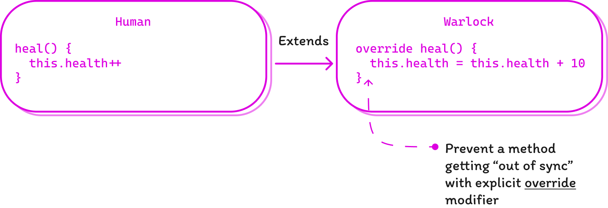

## {{ title }}

A newly released major update of TypeScript 5.0 introduced a lot of significant changes like [stable decorators](https://www.typescriptlang.org/docs/handbook/release-notes/typescript-5-0.html#decorators), regular enums replaced with [union enums](https://www.typescriptlang.org/docs/handbook/release-notes/typescript-5-0.html#all-enums-are-union-enums) and many others. Reading throught release notes however I stumbled upon new compiler options which I found smart yet I asked myself: Is there any reason to set up your custom compiler settings? A short answer - yes.

To be honest, I've never set up `tsconfig.json` for myself before. Most of us, developers, are just fine with default configs in any environment or a framework we use for building our projects. These configs are time-tested and designed to satisfy the demands of both comfort development and safety. For most cases this is true but while we don't bother about how our tool works, we're probably missing an opportunity to make our work more comfortable.

Thus, I introduce you to 5 TypeSctipt compiler flags which I belevie can improve your development experience.

### `noImplicitOverride: true`

This option is very helpful when working with inheritance. For instance, imagine you develop a game where the base class `Human`, who can heal himself for only one point at a time, is extended by the class `Warlock` who can do this for a dozen of points instantly (because he has some supernatural power, obviously).

```ts
class Human {
 heal() {
  this.health++
 }
}

class Warlock extends Human {
 heal() {
  this.health = this.health + 10
 }
}
```

After refactoring the `Human` class so that he can restore the whole stats at once (like energy, hunger, fatigue) you rename your method to `restoreStats`:

```ts
class Human {
 restoreStats() {}
}

class Warlock extends Human {
 heal() {
  // and what about the warlocks?
 }
}
```

In this situation the Warlock's method `heal` gets out of sync without *any warning* from the compiler. But when you have `noImplicitOverride` enabled you can see the error telling you that the method must have an `override` modifier:

```ts
class Human {
 heal() {}
}

class Warlock extends Human {
  override heal() {}
}

class Witch extends Human {
  heal() {}
 // Error: This member must have an 'override' modifier
 // because it overrides a member in the base class 'Human'.
}
```



> When a method [on a child class] is marked with override, TypeScript will always make sure that a method with the same name exists in the base class. ([TypeScript docs](https://www.typescriptlang.org/docs/handbook/release-notes/typescript-4-3.html))

### `noUncheckedIndexedAccess: true`

In TypeScript there is a way to describe an object with indefinite keys. This is a really nice feature which lets us not to be bound to known-only list of properties for our object.

Imagine you have an interface for a game settings file which you can fetch with the `getGameSettings` method. We know that tere must be at least two known properties in this object: the **difficulty** of the game and the **graphics** preset:

```ts
interface GameSettings {
  difficulty: "easy" | "medium" | "hard";
  graphics: "performace" | "balanced" | "quality"

  // Unknown properties are covered by this index signature.
  [key: string]: string;
}

const settings: GameSettings = getSettings()

console.log(config.difficulty) // 'easy'
console.log(config.graphics) // 'balanced'
```

Ok, say we know that there might be another property like `player` and we expect it to be a string, but how can we be certain that this property even exists?

```ts
const greet = (name: string) => console.log(`Welcome, ${name}`)
greet(config.player) // settings.player is considered a string, no warnings
```

So basicaly we need the TypeScript compiler to remind us about this blind spot and this is what `noUncheckedIndexedAccess` setting to `true` does:

```ts
greet(config.player) // Error: Argument of type 'string | undefined' is not assignable to parameter of type 'string'.
```

Neat, isn't it? Now the compiler warns us that unknown property may not exist and we should check its validity first:

```ts
if (config.player) greet(config.player) // Ok.
```

### `noPropertyAccessFromIndexSignature: true`

In addition to the previous example there might be one another improvement which adds some style consitency in the way we work with object properties. With the `noPropertyAccessFromIndexSignature` set to `true` it becomes clear that the dot notation must be used only with defined fields e.g., `settings.difficulty` and indexed synax can be used on both known and unknown properties:

```ts
// noPropertyAccessFromIndexSignature: false
const currentGameDifficulty = settings.difficulty
const player = settings.player // Ok

// noPropertyAccessFromIndexSignature: true
const player = settings.player // Error: Property 'player' comes from an index signature, so it must be accessed with ['player'].
```

This is just the nice way to standartise the code style in your project using compiler settings.

### `allowUnreachableCode: false`

In the example below, the `else` block inside the function `isVillian` will never be executed. If neither condition is true, the function will return `true` in the first if block. Therefore, the else block that contains the `console.log()` statement will never be reached:

```ts
// Checks if the hero is villian by the level of his kindness
function isVillian(kindness: number): boolean {
  if (kindness < 0) {
    return true;
  } else if (kindness > 0) {
    return false;
  } else {
    // This block of code will never be executed
    console.log("This line will never be reached.");
    return false;
  }
}
```

Your IDE most likely will show you a warning next to unreachable block, but without `allowUnreachableCode` set to `false` your code still will be complied. Though there's a fat chance for a bug or a performance issue to pop up at runtime, unreachable code can confuse developers who are reading or maintain your codebase. It can make the code harder to understand and follow the logic.

### `noFallthroughCasesInSwitch: true`

This option forces your compiler to check for fallthrough cases in switch statements so you must include either `break`, `return`, or `throw` after each case. This will prevent you from getting a case fallthrough bug at runtime:

```ts
function handleGameState(): void {
  switch (currentGameState) {
    case GameState.MainMenu:
      showMainMenu();  // Error: Fallthrough case in switch.
    case GameState.Playing:
      startGame();
      break;
    case GameState.Paused:
      pauseGame();
      break;
  }
}
```

However it's still safe to write multiple case clauses associated with single code block statement:

```ts
function handleGameState(): void {
  switch (currentGameState) {
    case GameState.MainMenu:
    case GameState.Playing:
      playMusic();
      break;
    case GameState.Paused:
      pauseMusic();
      break;
  }
}
```

### Conclusion

By leveraging these compiler settings, you can enhance the safety, readability, and maintainability of your codebase. While the default configurations are well-tested and reliable, taking the time to explore and fine-tune the compiler settings can offer valuable insights and optimizations. However it's essential to strike a balance between convenience and customization, try to discuss the style you are going to use with your team and construct the environment which is enjoyed by all 😉.
